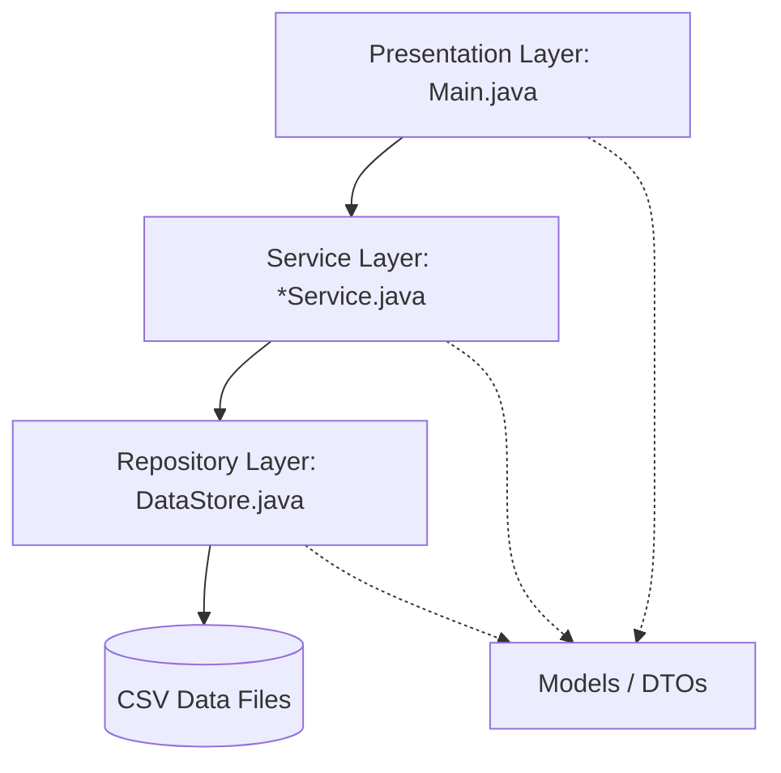

# System Architecture

## Overview
SmartRail uses a 3-tier layered architecture commonly found in enterprise Java applications, scaled down for a CLI environment. 

## Layers
1. **Presentation Layer (CLI)**
   - Entry point: `Main.java`
   - Handles Scanner inputs, shows menus, captures user choices, and calls service layer.
   
2. **Service Layer**
   - Core business logic.
   - Files: `PassengerService`, `TrainService`, `BookingService`, `CancellationService`, `ReportService`.
   - Responsibilities: Validating logic, orchestrating calls, throwing domain exceptions.

3. **Repository Layer**
   - `DataStore.java` handles all persistence logic. 
   - Abstracts File IO, translating Java Model Objects to CSV Strings and vice versa.

4. **Data Layer**
   - Text files residing in `data/`.
