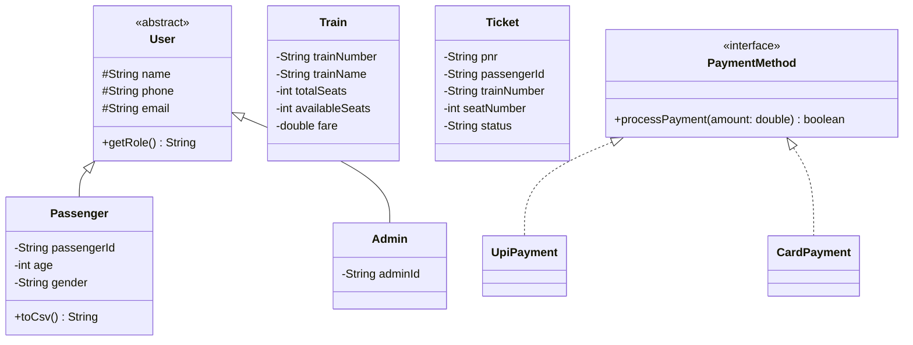

# System Design

## Class Diagram

## Data/Storage Design
Data is stored locally to mimic a NoSQL/Document structure using plain CSV format. 

- **passengers.csv**: `passengerId,name,age,gender,phone,email`
- **trains.csv**: `trainNumber,trainName,source,destination,totalSeats,availableSeats,fare`
- **tickets.csv**: `pnr,passengerId,trainNumber,seatNumber,bookingDate,fare,status`

This design prioritizes simplicity and strict decoupling of persistence (`DataStore`) from the domain (`Services`).
