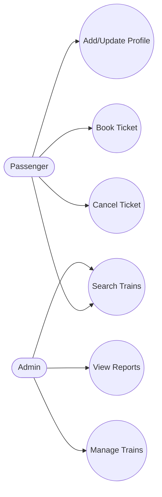

# Use Case Diagram

```mermaid
flowchart LR
    actor_passenger([Passenger])
    actor_admin([Admin])
    
    uc1((Add/Update Profile))
    uc2((Search Trains))
    uc3((Book Ticket))
    uc4((Cancel Ticket))
    uc5((View Reports))
    uc6((Manage Trains))
    
    actor_passenger --> uc1
    actor_passenger --> uc2
    actor_passenger --> uc3
    actor_passenger --> uc4
    
    actor_admin --> uc5
    actor_admin --> uc6
    actor_admin --> uc2
```
