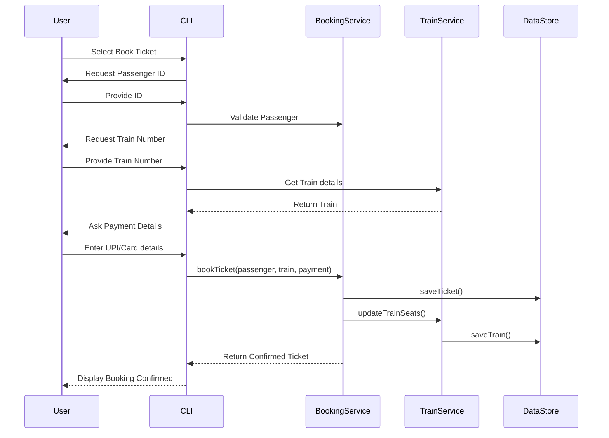
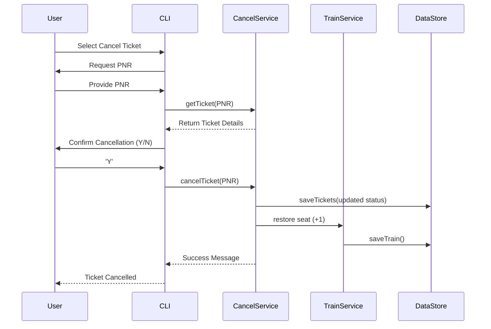

# Workflows

## Booking Workflow

```mermaid
sequenceDiagram
    participant User
    participant CLI
    participant BookingService
    participant TrainService
    participant DataStore
    
    User->>CLI: Select Book Ticket
    CLI->>User: Request Passenger ID
    User->>CLI: Provide ID
    CLI->>BookingService: Validate Passenger
    
    CLI->>User: Request Train Number
    User->>CLI: Provide Train Number
    CLI->>TrainService: Get Train details
    TrainService-->>CLI: Return Train
    
    CLI->>User: Ask Payment Details
    User->>CLI: Enter UPI/Card details
    
    CLI->>BookingService: bookTicket(passenger, train, payment)
    BookingService->>DataStore: saveTicket()
    BookingService->>TrainService: updateTrainSeats()
    TrainService->>DataStore: saveTrain()
    BookingService-->>CLI: Return Confirmed Ticket
    CLI-->>User: Display Booking Confirmed
```

## Cancellation Workflow

```mermaid
sequenceDiagram
    participant User
    participant CLI
    participant CancelService
    participant TrainService
    participant DataStore
    
    User->>CLI: Select Cancel Ticket
    CLI->>User: Request PNR
    User->>CLI: Provide PNR
    CLI->>CancelService: getTicket(PNR)
    CancelService-->>CLI: Return Ticket Details
    CLI->>User: Confirm Cancellation (Y/N)
    User->>CLI: 'Y'
    CLI->>CancelService: cancelTicket(PNR)
    CancelService->>DataStore: saveTickets(updated status)
    CancelService->>TrainService: restore seat (+1)
    TrainService->>DataStore: saveTrain()
    CancelService-->>CLI: Success Message
    CLI-->>User: Ticket Cancelled
```
